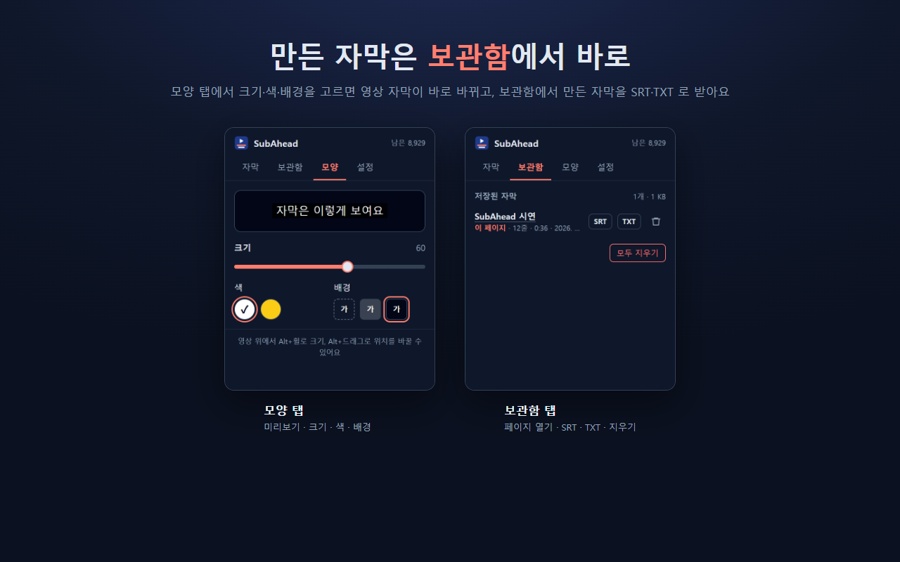

# SubAhead

웹페이지의 HTML5 영상 소리를 **미리 통째로 받아 적어서**, 영상을 어디로 넘겨도 그 장면에 맞는 한국어 자막을 띄우는 Chrome 확장 프로그램이에요.

실시간 자막(Chrome·macOS 기본 기능)은 지금 들리는 소리만 몇 초 늦게 보여 줘요. SubAhead는 버튼 한 번으로 영상 전체 자막을 시간표와 함께 먼저 만들어 두기 때문에, 앞뒤로 넘겨도 자막이 바로 맞아요.

## 기능

- 페이지 안의 HTML5 영상(일반 영상 파일, HLS 스트림)을 자동으로 찾아요.
- 한 페이지에 영상이 여러 개면 팝업에 체크 목록(페이지 위→아래 순서)이 나와요. 처음엔 모두 체크돼 있고, 빼고 싶은 영상만 끄면 나머지를 만들어요. 앞 영상이 게이트웨이에서 받아 적히는 동안 다음 영상의 소리를 미리 뽑아 둬서, 하나씩 할 때보다 빨라요. 목록에 마우스를 올리면 그 영상에 테두리가 표시돼요.
- 영상 위를 오른쪽 클릭해 **이 영상 자막 만들기**로 그 영상만 만들 수도 있어요.
- 영상에서 **소리만** 뽑아(확장 안의 ffmpeg.wasm) 음성인식 서버로 보내요. 화면 데이터는 보내지 않아요.
- 만들기 전에 영상 길이·예상 비용·남은 크레딧을 보여 주고, 진행 상황을 단계별로 보여 줘요. 진행 중에 취소할 수 있고(이미 올린 소리의 크레딧은 돌아오지 않음), 게이트웨이가 너무 오래 답하지 않으면(소리 길이의 3배, 최소 3분) 멈추고 다시 시도를 권해요.
- 브라우저 기본 자막으로 표시해서 전체화면에서도 보여요.
- 팝업의 **모양** 탭에서 미리보기를 보며 크기(0~100)·색(흰색·노랑)·배경(없음·반투명·진하게)을 바꾸면 영상 자막이 바로 바뀌어요.
- 한 번 만든 자막은 브라우저에 저장돼서, 같은 영상을 다시 열면 크레딧 없이 바로 붙어요. **설정** 탭의 저장된 자막 목록에서 자막 파일(.srt)로 내려받을 수 있어요.
- 단축키와 Alt(Mac 은 Option) 조작:

| 동작 | 방법 |
|---|---|
| 자막 만들기 | 기본 키 없음 — `chrome://extensions/shortcuts` 에서 정해요. 한 번 누르면 비용 안내, 4초 안에 한 번 더 누르면 시작 |
| 자막 켜기·끄기 | `Alt+Shift+S` |
| 크기 바꾸기 | `Alt+Shift+↑`, 또는 영상 위에서 `Alt+휠` |
| 싱크 0.5초 빠르게 / 늦게 | `Alt+Shift+←` / `Alt+Shift+→` (영상별로 기억) |
| 자막 위치 옮기기 | 영상 위에서 `Alt+드래그` (기본은 아래 가운데) |

단축키는 `chrome://extensions/shortcuts` 에서 바꿀 수 있어요.

## 필요한 것

음성인식 모델 **`stt-async-v5`** 를 제공하는 API 게이트웨이의 **주소(Base URL)와 API 키**가 필요해요. 확장 아이콘을 누르면 처음에 이 둘을 넣는 화면이 나와요. 음성인식 비용은 그 게이트웨이 요금으로 청구돼요.

## 설치 (개발 중 버전)

1. 이 저장소를 내려받아요.
2. Chrome 에서 `chrome://extensions` 를 열고 **개발자 모드**를 켜요.
3. **압축해제된 확장 프로그램 로드**를 눌러 `extension-standalone` 폴더를 골라요.
4. 확장 아이콘 → 게이트웨이 주소와 키 입력 → 영상 페이지에서 **전체 자막 만들기**.

## 안 되는 것

- 보호(암호화, DRM)된 영상과 생방송은 지원하지 않아요.
- 받아 적는 언어는 한국어만 돼요. 화면 글자는 한국어·영어를 지원해요.
- 시청 권한이 있는 영상에만 써 주세요. 이 확장은 영상을 저장하거나 내려받는 기능을 제공하지 않아요.

## 폴더 구성

| 폴더 | 내용 |
|---|---|
| `extension-standalone/` | 확장 프로그램 본체 (웹스토어에 올리는 것) |
| `demo/` | 시험용 페이지와 영상 (`python3 demo/serve.py` → `http://127.0.0.1:8000`, HLS 시험은 `/hls/`) |
| `store/` | 웹스토어 설명 글, 개인정보처리방침, 스크린샷 |
| `tools/i18n_messages.py` | 화면 문구 원본(한국어·영어). 고친 뒤 실행하면 `_locales` 가 다시 만들어져요 |
| `archive/hackathon/` | 처음 만들었던 "확장 + 내 PC 서버" 방식 (보관용) |

웹스토어 업로드용 zip 은 `extension-standalone` 폴더 안의 파일을 묶어 만들어요(저장소에는 올리지 않음).

## 개인정보

개발자는 서버를 운영하지 않고 정보를 모으지 않아요. 게이트웨이 주소·키·만든 자막·설정은 사용자 브라우저에만 저장되고, 영상의 소리와 키는 자막을 만들 때 사용자가 설정한 게이트웨이로만 보내요. 자세한 내용은 [`store/privacy.html`](store/privacy.html)에 있어요.

## 라이선스

[라이선스 미정]

---

## English

**SubAhead** is a Chrome extension that transcribes the audio of an HTML5 video on a web page **ahead of time**, so Korean subtitles stay in sync wherever you seek.

- Finds HTML5 videos (files and HLS), extracts audio only (ffmpeg.wasm), and sends it to your speech recognition gateway.
- On pages with several videos, a checklist in the popup (in page order, all checked by default) lets you leave some out; the rest are made with overlap (the next video's audio is extracted while the previous one is being transcribed). Or right-click a video → **Create subtitles for this video**.
- Live preview in the Style tab to adjust size, color and background; subtitles are saved, re-applied automatically, and can be downloaded as .srt from Settings.
- Cancel while creating; stops with a retry prompt if the gateway takes too long.
- Shortcuts: "Create subtitles" (no default key; set it at `chrome://extensions/shortcuts`, press twice to start), `Alt+Shift+S` toggle, `Alt+Shift+↑` size, `Alt+Shift+←/→` sync ±0.5s, `Alt+wheel` resize, `Alt+drag` move.
- **Requires** the Base URL and API key of an API gateway that provides the `stt-async-v5` speech recognition model.
- Install: `chrome://extensions` → Developer mode → Load unpacked → `extension-standalone`.
- Not supported: DRM-protected videos, live streams. Transcription is Korean only; the UI supports Korean and English.
